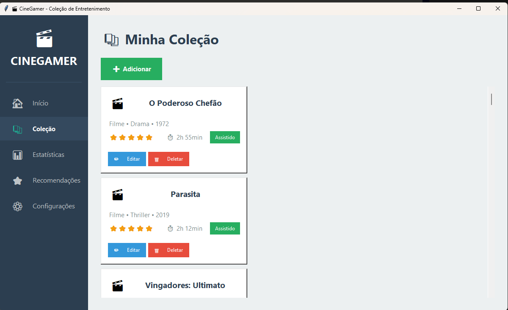
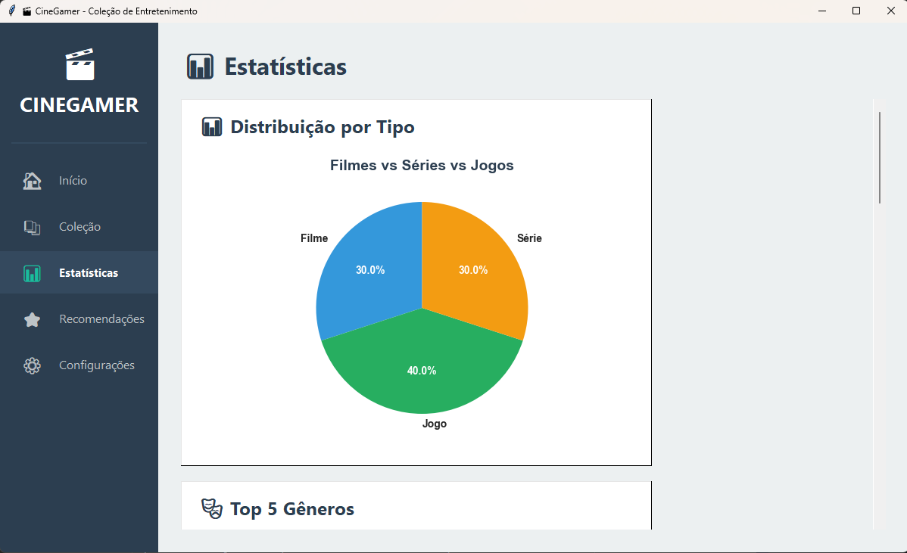
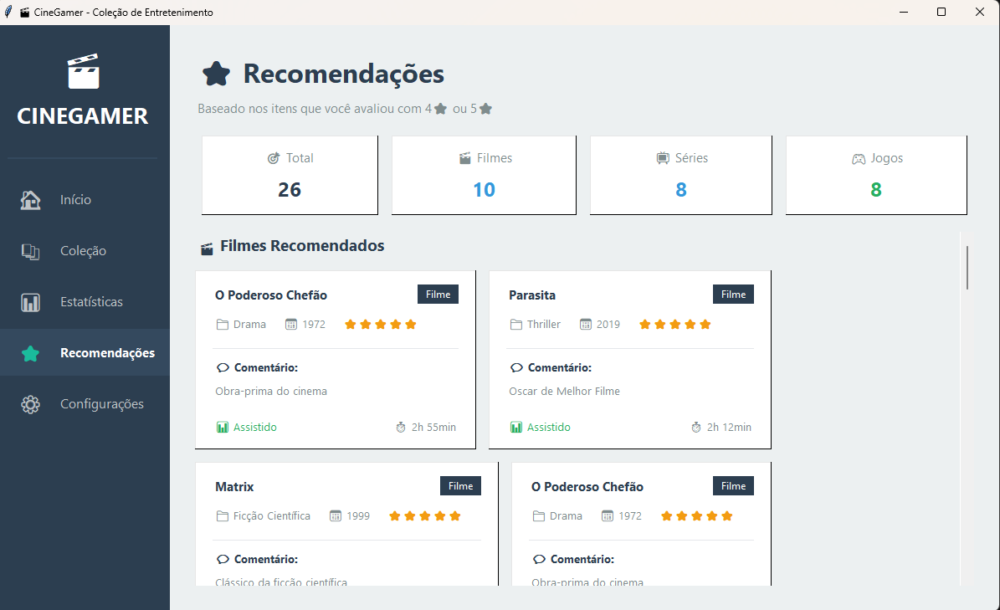

# 🎬 CineGamer

Sistema desktop para gerenciamento de coleção de entretenimento (filmes, séries e jogos).


---

## 📋 Sobre o Projeto

CineGamer é uma aplicação desktop desenvolvida em Python com Tkinter que permite organizar e gerenciar sua coleção pessoal de filmes, séries e jogos. O sistema oferece funcionalidades completas de CRUD, sistema de recomendações baseado em suas avaliações e visualização de estatísticas através de gráficos interativos.

### ✨ Funcionalidades Principais

- ✅ **CRUD Completo** - Adicionar, visualizar, editar e excluir itens
- 📊 **Estatísticas Visuais** - Gráficos interativos com suas métricas
- ⭐ **Sistema de Recomendações** - Sugestões baseadas em suas avaliações
- 🎨 **Interface Moderna** - Design limpo e intuitivo
- 💾 **Banco de Dados Local** - SQLite para persistência de dados
- 🔍 **Organização por Status** - Assistido, Assistindo, Pendente, Abandonado

---

## 🖼️ Screenshots

### Tela Inicial


### Gerenciamento de Coleção



### Estatísticas



### Recomendações



---

## 🚀 Tecnologias Utilizadas

- **Python 3.8+** - Linguagem de programação
- **Tkinter** - Interface gráfica
- **SQLite** - Banco de dados
- **Matplotlib** - Gráficos e visualizações
- **Pillow** - Manipulação de imagens (se necessário)

---

## 📦 Instalação

### Pré-requisitos

- Python 3.8 ou superior
- pip (gerenciador de pacotes Python)

### Passo a Passo

1. **Clone o repositório**

```bash
git clone https://github.com/BrunoConceica0/CIneGamer.git
cd cinegamer
```

2. **Instale as dependências**

```bash
pip install -r requirements.txt
```

3. **Execute o sistema**

```bash
python main.py
```

---

## 📁 Estrutura do Projeto

```
CineGamer/
├── main.py                    # Arquivo principal
├── requirements.txt           # Dependências
├── cineGamer.db              # Banco de dados (gerado automaticamente)
├── config/                    # Configurações do banco
├── utility/                   # Cores, fontes e configurações UI
├── components/                # Componentes reutilizáveis
├── hooks/                     # Dialogs e janelas modais
├── page/                      # Páginas da aplicação
└── screenshots/               # Capturas de tela
```

---

## 🎮 Como Usar

### Adicionar um Item

1. Clique no botão **"➕ Adicionar Novo"** na tela inicial
2. Preencha os campos obrigatórios (marcados com \*)
3. Clique em **"💾 Salvar"**

### Editar um Item

1. Navegue até **"📚 Coleção"**
2. Clique no botão **"✏️ Editar"** do item desejado
3. Modifique os campos
4. Clique em **"💾 Atualizar"**

### Ver Recomendações

1. Avalie alguns itens com 4⭐ ou 5⭐
2. Acesse **"⭐ Recomendações"**
3. Veja sugestões personalizadas baseadas em seus gostos

### Visualizar Estatísticas

1. Acesse **"📊 Estatísticas"**
2. Explore os gráficos:
   - Distribuição por tipo (Filme/Série/Jogo)
   - Gêneros mais populares
   - Status dos itens
   - Timeline de lançamentos
   - Distribuição de avaliações

---

## 🗂️ Banco de Dados

O sistema utiliza SQLite com a seguinte estrutura:

### Tabela: contents

| Campo        | Tipo    | Descrição                                   |
| ------------ | ------- | ------------------------------------------- |
| id           | INTEGER | Identificador único                         |
| name         | TEXT    | Nome do item                                |
| type         | TEXT    | Filme, Série ou Jogo                        |
| genre        | TEXT    | Gênero                                      |
| year         | INTEGER | Ano de lançamento                           |
| rating       | INTEGER | Avaliação (1-5 estrelas)                    |
| status       | TEXT    | Assistido, Assistindo, Pendente, Abandonado |
| time_minutes | INTEGER | Duração em minutos                          |
| observations | TEXT    | Comentários pessoais                        |

---

## ⚙️ Configuração

### Cores e Temas

Personalize as cores em `utility/config.py`:

```python
colors = {
    'primary': '#3B82F6',
    'success': '#10B981',
    'alert': '#F59E0B',
    'erro': '#EF4444',
    # ... outras cores
}
```

### Listas e Opções

Modifique as opções em `utility/ui_config.py`:

```python
genres = ['Ação', 'Aventura', 'Comédia', 'Drama', ...]
types = ['Filme', 'Série', 'Jogo']
status = ['Assistido', 'Assistindo', 'Pendente', 'Abandonado']
```

---

## 🧪 Testes

Para executar os testes (quando disponíveis):

```bash
pytest tests/
```

---

## 🐛 Problemas Conhecidos

- [ ] Nenhum problema crítico identificado

## 📝 Roadmap

- [ ] Busca e filtros avançados
- [ ] Exportação para CSV/PDF
- [ ] Integração com APIs (TMDB, IGDB)
- [ ] Upload de imagens/capas
- [ ] Tema escuro
- [ ] Backup automático

---

## 🤝 Contribuindo

Contribuições são bem-vindas! Sinta-se livre para:

1. Fazer um Fork do projeto
2. Criar uma branch para sua feature (`git checkout -b feature/NovaFuncionalidade`)
3. Commit suas mudanças (`git commit -m 'Adiciona nova funcionalidade'`)
4. Push para a branch (`git push origin feature/NovaFuncionalidade`)
5. Abrir um Pull Request

---

## 📄 Licença

Este projeto está sob a licença MIT. Veja o arquivo [LICENSE](LICENSE) para mais detalhes.

---

## 👤 Autor

**Bruno**

- GitHub: [@seu-usuario](https://github.com/BrunoConceica0)
- LinkedIn: [Seu Nome](https://www.linkedin.com/in/brunocds97)
- Email: bruno214600@gmail.com

---

## 🙏 Agradecimentos

- Desenvolvido como projeto acadêmico para a disciplina de Desenvolvimento Rápido de Aplicações
- Estácio - Curso de Análise e Desenvolvimento de Sistemas (ADS)
- Agradecimentos especiais aos colegas e professores


<div align="center">
  
**⭐ Se este projeto te ajudou, considere dar uma estrela!**

Desenvolvido com ❤️ por Bruno

</div>
